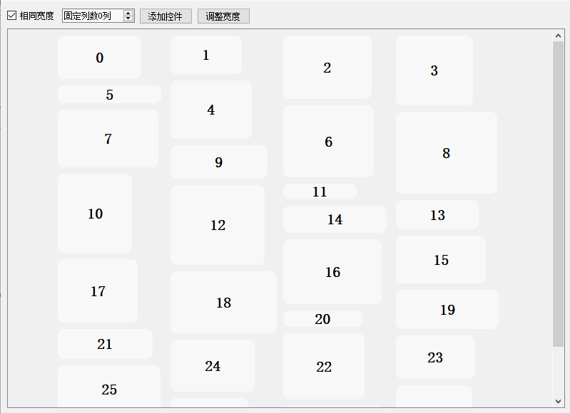
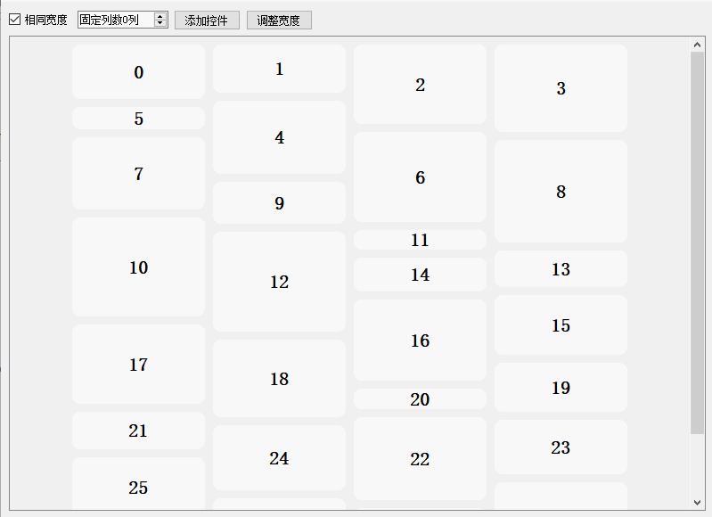

瀑布流控件
===

简单易用的 Qt 瀑布流控件，不止能添加图片(QLabel)，支持任意可视化子控件。

并且允许添加任意不规则宽高的控件，比一般的瀑布流更加自由。

功能：

- 相同宽度模式
  - 统一根据 `sizeHint` 调整大小
  - 统一根据最大控件宽度调整大小
  - 自动调整列数，或者固定列数
- 不规则宽高模式
  - 支持任意宽高
  - 自动调整排列
- 动态添加控件，计算位置
- 自定义边距、间距
- 批量非线性动画，可开关
- 平滑滚动

